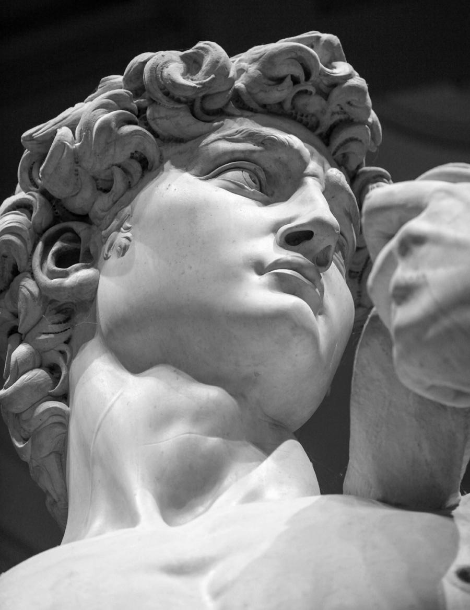
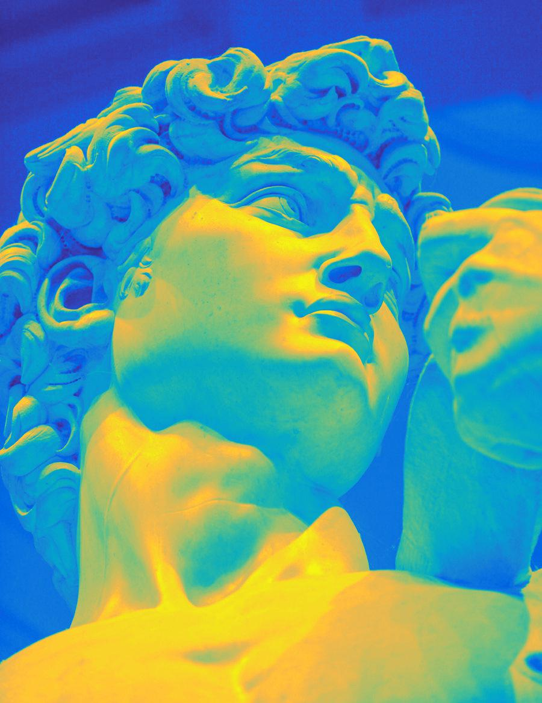
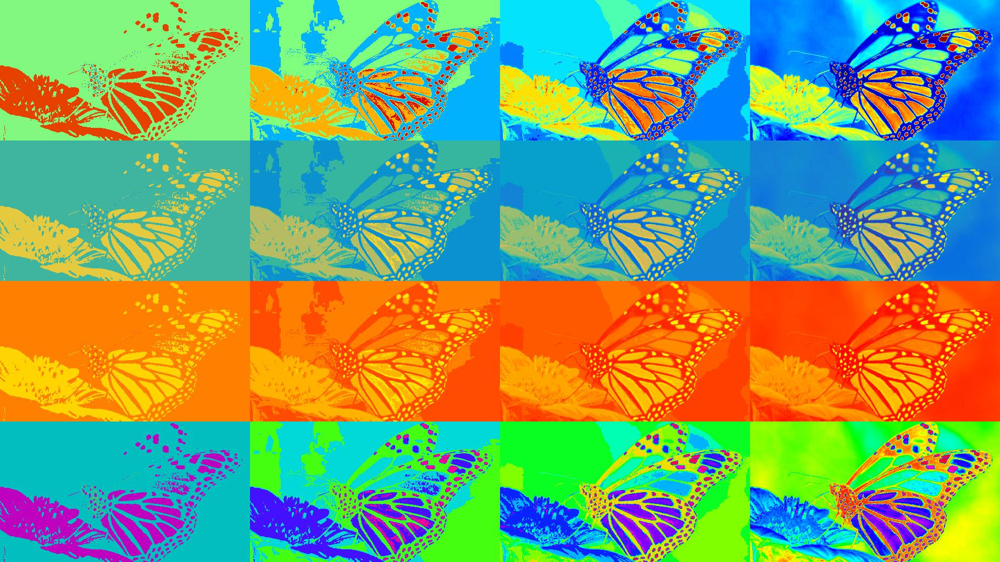
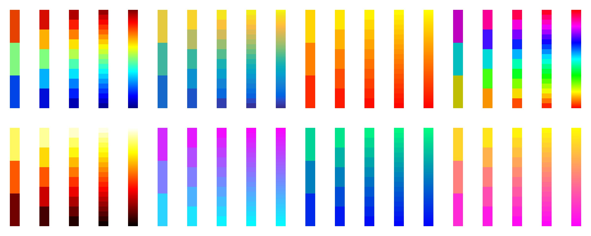

# Torch Colormap

Colormaps for visualizing greyscale images in Torch. All styles in MATLAB (parula, jet, hsv, autumn, and everything else [here](http://www.mathworks.com/help/matlab/ref/colormap.html)) are supported. 

## Installation

`$ luarocks install colormap`

Requires [Torch7](http://torch.ch/), [luafilesystem](https://github.com/keplerproject/luafilesystem), and [image](https://github.com/torch/image).

## Usage
1. 	Choose the style and number of unique colors in the map with something like:

	`> require 'colormap'`

	`> colormap:setStyle('parula')` 

	`> colormap:setSteps(512)`

2. Pass in a single-channel image

	`> img = image.load('david.jpg')`

	`> rgbImg = colormap:convert(img)`

3. If you want a colorbar to go along with it:

	`> bar = colormap:colorbar(height, width)`

 
 

<em> Greyscale and colored David </em>

Running `> colormap:samples()` will generate images of a butterfly visualized with a few different styles and step numbers:

 

as well as some colorbars for the more common maps:

